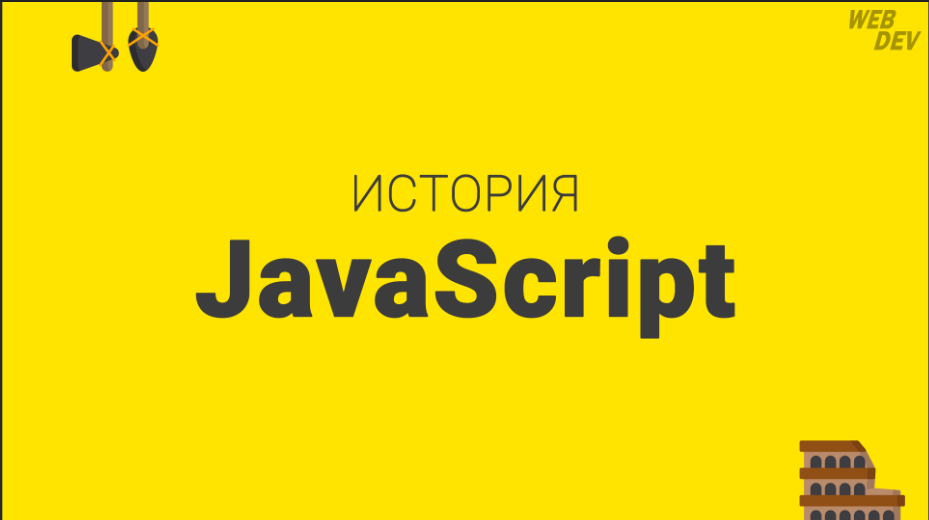
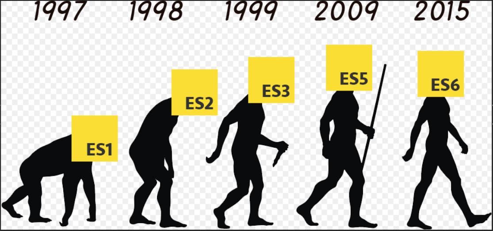

# Что такое JavaScript?
JavaScript – это интерпретируемый язык программирования высокого уровня, который в основном используется в качестве языка сценариев для веб-разработки. Это одна из трех основных технологий Всемирной паутины наряду с HTML и CSS.
>
>
Язык программирования JavaScript позволяет создавать интерактивные веб-страницы и является неотъемлемой частью веб-приложений. В то время как HTML определяет структуру и макет веб-страницы, а CSS придает ей стиль, JavaScript делает ее интерактивной, обеспечивая динамическое содержание и взаимодействие с пользователем.
>
>
>

1. Истоки JavaScript:
JavaScript был создан Бренданом Эйхом в 1995 году, когда он работал в Netscape Communications Corporation. Первоначально он был разработан как простой скриптовый язык под названием «Mocha» для добавления интерактивности веб-страницам. Позже он был переименован в "LiveScript" и, наконец, в "JavaScript", чтобы использовать популярность Java.
>
>
2. Ранние дни и браузерные войны:
На заре Интернета JavaScript завоевал популярность благодаря своей способности улучшать пользовательский опыт, добавляя динамические элементы на веб-страницы. Тем не менее, он столкнулся с проблемами совместимости браузеров, поскольку разные браузеры реализовали JavaScript по-разному. Это привело к печально известным «браузерным войнам», в которых поставщики браузеров конкурировали за лучшую поддержку JavaScript.
>
>
 3. Стандартизация с помощью ECMAScript:
Чтобы решить проблемы совместимости, организация по стандартизации Ecma International выступила с инициативой стандартизации JavaScript. Стандартизированная спецификация JavaScript известна как ECMAScript. Первое издание ECMAScript, ES1, было выпущено в 1997 году. С тех пор было выпущено несколько версий ECMAScript, каждая из которых представляла новые возможности и улучшения.
>
>
4. Эволюция ECMAScript:
Давайте взглянем на некоторые важные версии ECMAScript:

- ECMAScript 3 (ES3): Выпущенный в 1999 году, ES3 представил такие функции, как регулярные выражения, обработка исключений try/catch и многое другое.
- ECMAScript 5 (ES5): Выпущенный в 2009 году, ES5 принес значительные улучшения, включая строгий режим, поддержку JSON и методы массива, такие как forEach, map и reduce.
- ECMAScript 6 (ES6): Выпущенный в 2015 году, ES6 внес в язык значительные изменения и дополнения, такие как стрелочные функции, классы, модули и улучшенные объектные литералы.
- ECMAScript 2015+ (ES2015+): Вслед за ES6 ECMAScript принял ежегодный цикл выпуска, внедряя новые функции и улучшения с каждой версией. Заметные дополнения включают async/await, деструктуризацию, синтаксис распространения и многое другое.
5. Современный JavaScript:
Сегодня JavaScript не ограничивается веб-браузерами. Он расширил свой охват серверной разработки с такими платформами, как Node.js. Фреймворки и библиотеки JavaScript, такие как React, Angular и Vue.js, также приобрели огромную популярность, позволяя разработчикам создавать сложные и интерактивные веб-приложения.